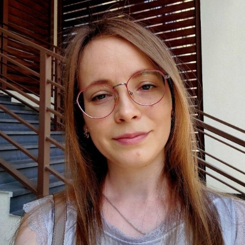

<table>
    <tr>
        <td></td>
        <td valign="top">
            <big><strong>Екатерина Бахтина</strong></big> 
            <em>Ручной тестировщик / QA Engineer</em> 
            

            📞 +7 (920) 812-31-62 
            ✉️ almazniegori@gmail.com 
            💬 <a href="https://vk.ru/id426700170">ВКонтакте</a>
        </td>
    </tr>
</table>

<big><strong>Ключевые навыки</strong></big> 

<strong>Виды тестирования:</strong> 
&nbsp;&nbsp;&nbsp;• функциональное 
&nbsp;&nbsp;&nbsp;• регрессионное 
&nbsp;&nbsp;&nbsp;• интеграционное 
&nbsp;&nbsp;&nbsp;• smoke 
&nbsp;&nbsp;&nbsp;• критического пути 
<strong>Инструменты:</strong> Jira (баг-трекинг), Git. 
<strong>Работа с API:</strong> Postman, Swagger. 
<strong>Технологии:</strong> 
&nbsp;&nbsp;&nbsp;• понимание клиент-серверной архитектуры  
&nbsp;&nbsp;&nbsp;• HTML/CSS (основы)  
&nbsp;&nbsp;&nbsp;• SQL  
&nbsp;&nbsp;&nbsp;• Python  
&nbsp;&nbsp;&nbsp;• Pytest  
&nbsp;&nbsp;&nbsp;• DevTools  
<strong>Методологии:</strong> Agile (Scrum, Kanban).
  
<big><strong>Опыт работы</strong></big> 

<strong>QA Инженер | ООО Организация качества / Адакта</strong> 
<em>Период работы (2024 — настоящее время)</em> 
&nbsp;&nbsp;&nbsp;• обеспечение качества веб-приложения 
&nbsp;&nbsp;&nbsp;• проведение функционального, интеграционного и регрессионного тестирования 
&nbsp;&nbsp;&nbsp;• написание тест-кейсов и чек-листов 
&nbsp;&nbsp;&nbsp;• оформление найденных дефектов 
&nbsp;&nbsp;&nbsp;• взаимодействие с командой 

<strong>Специалист по разметке данных | ООО АБТ</strong> 
<em>Период работы (2023 — 2024)</em> 
&nbsp;&nbsp;&nbsp;• разметка видео-, аудио- и текстовых данных для нейросетей 

<strong>Аспирант-наставник | Нетология</strong> 
<em>Период работы (2023 — настоящее время)</em> 
&nbsp;&nbsp;&nbsp;• помощь студентам в чатах и в выполнении домашних заданий 
  
<big><strong>Образование и курсы</strong></big> 

  
<big><strong>Дополнительная информация</strong></big> 

Профессиональные интересы: Регулярно читаю статьи на Habr и Medium о тест-дизайне и автоматизации, смотрю доклады с конференций (Heisenbug, SQA Days) .

Личные качества: Внимателен к деталям, педантичен, имею аналитический склад ума. Умею аргументированно отстаивать свою точку зрения (баг — не фича). Высокая самоорганизация для удаленной работы.

Иностранный язык: Английский — B1 (читаю техническую документацию, могу написать баг-репорт на английском) .
